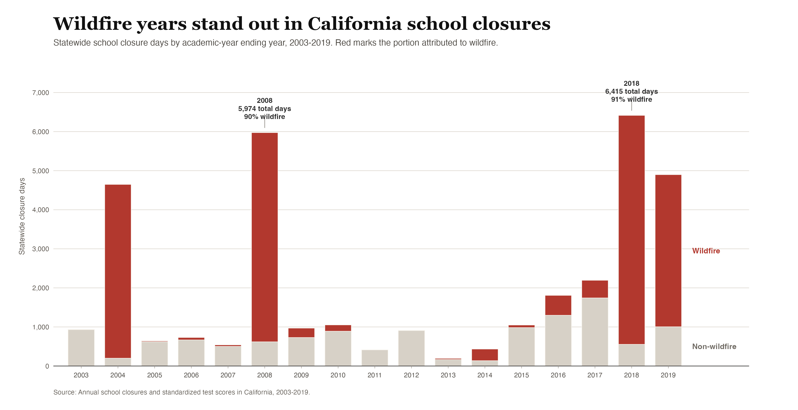
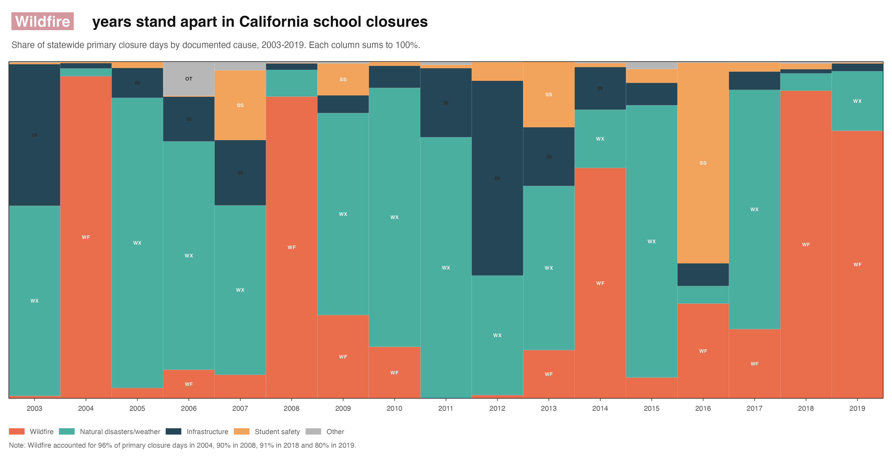
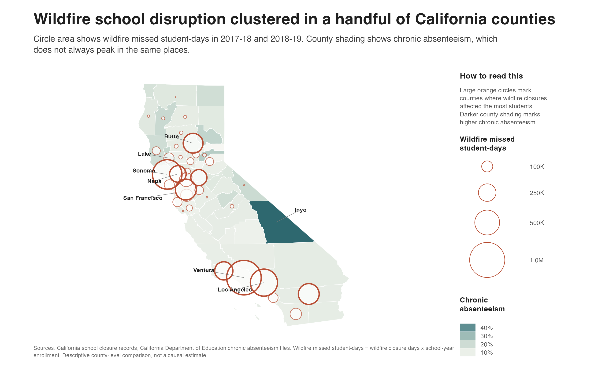
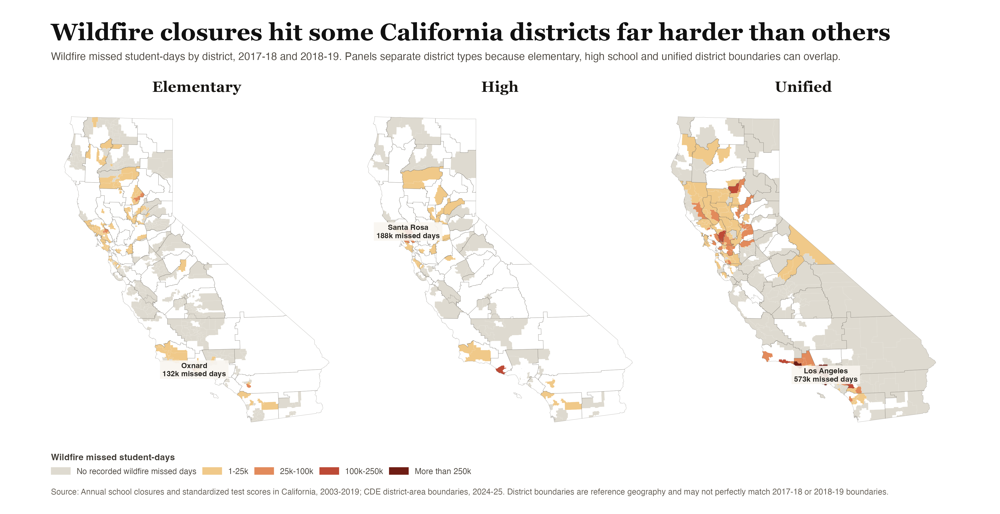
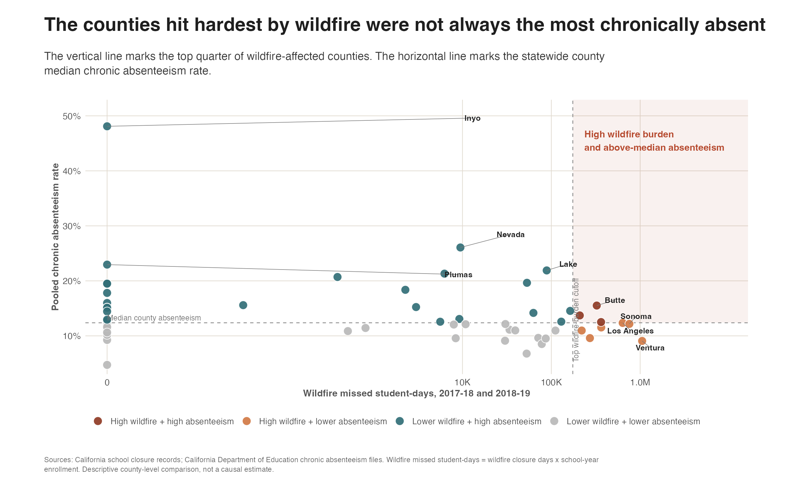

# Wildfire School Disruption And Chronic Absenteeism In California

## Question

Where in California is wildfire disrupting schooling the most, and are those places also experiencing higher chronic absenteeism?

## Short Answer

Wildfire school disruption in 2017-18 and 2018-19 was widespread across California, but the heaviest burden was concentrated in a smaller set of counties and districts. The places with the most wildfire missed student-days were not always the places with the highest chronic absenteeism. The overlap exists, but it is partial.

That distinction matters. If decision-makers only look at wildfire closures, they may miss places where attendance problems were already high. If they only look at chronic absenteeism, they may miss places where many students lost instructional time because large schools or districts closed during wildfire events. This project uses both measures together to identify where attendance support after wildfire disruption may be most useful.

## How I Measured Disruption

I measured wildfire disruption with **wildfire missed student-days**:

`wildfire missed student-days = wildfire closure days x school-year enrollment`

This measure is useful because it combines how long schools were closed with how many students were affected. A one-day closure at a small school and a one-day closure across a large district are both disruptive, but they do not affect the same number of students.

For attendance, I used county-level chronic absenteeism counts and eligible enrollment from the California Department of Education. I focused on 2017-18 and 2018-19 because those years line up with the school closure records and come before the COVID-era disruption in attendance reporting.

## 1. Wildfire Was A Major Closure Driver

Wildfire was not just one small category of school closure in this period. In the statewide closure records, wildfire stands out in several years, especially 2017-18 and 2018-19. Those two years are the focus of the attendance comparison because wildfire accounted for a very large share of closure days during that window.

*Figure 1. Wildfire years stand out in California school closure records. Red marks the portion of statewide closure days attributed to wildfire.*

The share view tells the same story from a different angle. In 2017-18, wildfire accounted for about 91% of statewide primary closure days. In 2018-19, wildfire accounted for about 80%. That makes wildfire the right disruption category to examine more closely for these two school years.

*Figure 2. In the comparison years, wildfire made up most primary closure days, not just a minor share of the statewide closure total.*

## 2. The Largest Burden Was Concentrated

Wildfire disruption reached many places, but it was not evenly distributed. Across 2017-18 and 2018-19, 36 of California's 58 counties had at least some wildfire closure burden. The two-year statewide total was about 5.29 million wildfire missed student-days.

The largest missed student-day totals were concentrated in a small group of counties, including Ventura, Sonoma, Los Angeles, Contra Costa, Riverside, Butte, Santa Barbara, Napa, and Sacramento. These counties do not all tell the same story. Some had very large student populations exposed to closures, while others had intense disruption relative to their size.

*Figure 3. Wildfire missed student-days clustered in a smaller set of counties. County shading shows chronic absenteeism, which does not always peak in the same places as wildfire burden.*

## 3. District Patterns Were Also Uneven

The district map shows that wildfire burden was not only a county-level pattern. The disruption also concentrated within particular district geographies. Unified school districts carried much of the mapped burden, which matters because unified districts often include larger K-12 student populations.

The district boundaries in this figure are reference geography from 2024-25, so they should not be read as exact historical boundaries for 2017-18 and 2018-19. The map is still useful for understanding the shape of the disruption: wildfire-related closure burden was spatially uneven and concentrated, not spread evenly across every district type.

*Figure 4. District-level wildfire burden was concentrated, especially among unified school districts. Panels are separated because district boundaries can overlap by type.*

## 4. High Wildfire Burden Did Not Always Mean High Chronic Absenteeism

The central question is whether the places with the most wildfire disruption were also the places with higher chronic absenteeism. The answer is mixed.

At the county level, the median chronic absenteeism rate was similar across wildfire groups: about 12.2% among the top wildfire-burden counties, 12.2% among lower-burden wildfire-affected counties, and 12.6% among counties with no wildfire closure burden in this two-year window. That means the pattern is not a simple "more wildfire, more chronic absenteeism" relationship.

Some counties still deserve special attention because the two concerns overlap. Butte and Lake, for example, combined wildfire burden with above-median chronic absenteeism. Ventura had the highest wildfire missed student-days but a chronic absenteeism rate below the county median. This contrast is the main finding: wildfire disruption and chronic absenteeism both matter, but they do not identify exactly the same places.

*Figure 5. The overlap is partial. The upper-right area highlights counties with both high wildfire burden and above-median chronic absenteeism.*

## What This Means

Wildfire-related attendance support should be targeted with more than one measure. Counties and districts with high wildfire missed student-days may need strong continuity plans for instruction, transportation, communication, and student services during closure periods. Counties where high wildfire burden overlaps with higher chronic absenteeism may need additional re-engagement support after schools reopen.

The findings also show why a single statewide message is not enough. Some places experienced large wildfire disruption because many students were exposed. Other places may have had higher attendance risk even without the largest wildfire burden. The strongest planning signal comes from reading the disruption and attendance measures together.

## Important Limits

This is a descriptive analysis, not a causal estimate. The results show where wildfire closure burden and chronic absenteeism appeared together in the available records. They do not prove that wildfire closures caused higher or lower chronic absenteeism.

County summaries can hide school-level variation, and district maps use current reference boundaries that may not perfectly match the school years being studied. Chronic absenteeism rates also follow California Department of Education eligibility and suppression rules. Suppressed values are treated as missing, not zero.

Even with those limits, the story is clear: wildfire disrupted schooling most heavily in a concentrated set of California places, and those places were not automatically the same places with the highest chronic absenteeism. Planning for wildfire recovery should therefore account for both exposure to disruption and existing attendance risk.
